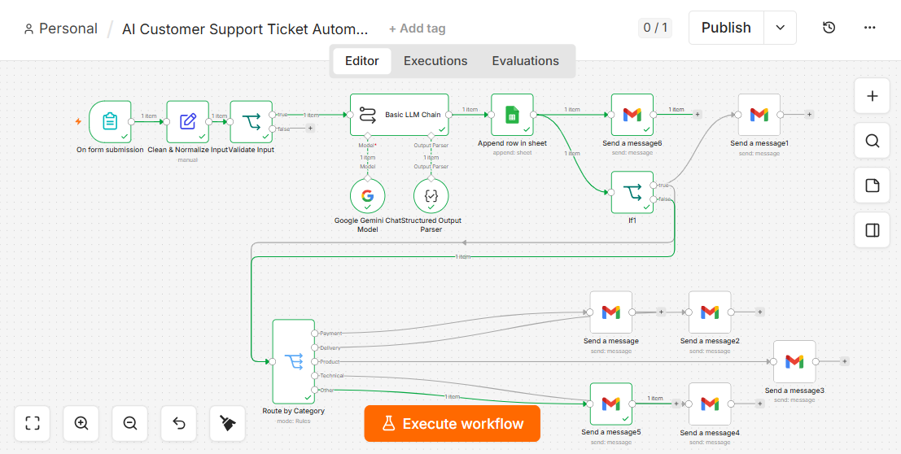
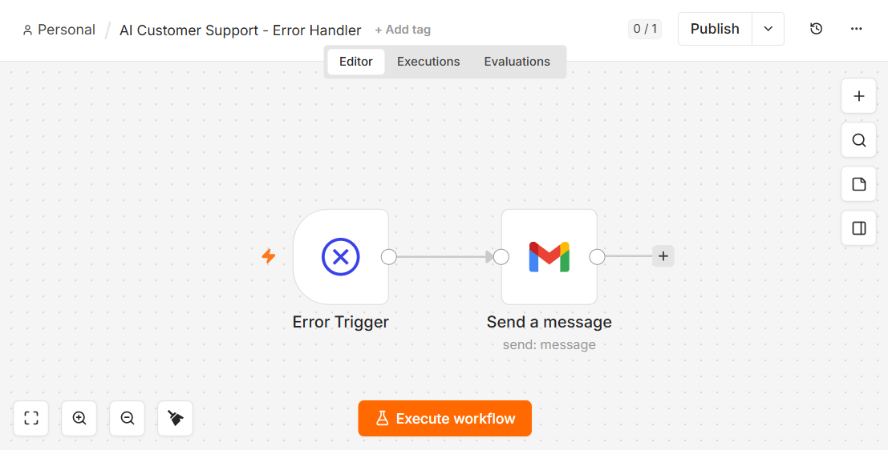
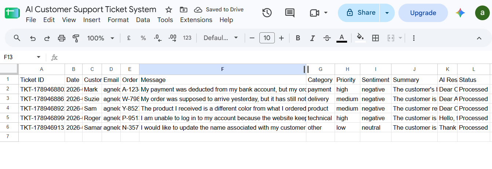
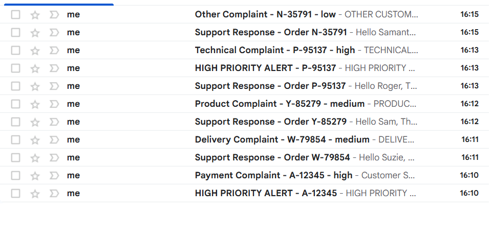

# AI Customer Support Ticket Automation System

## Overview

This project is an automated workflow that reads incoming customer complaints, understands what they're about, and routes them to the right team automatically — without a human needing to manually read, categorize, and forward every ticket. It classifies each complaint, logs it, and sends notifications to both the customer and the relevant department, with an extra alert path for high-priority issues.

Built independently for additional practice, based on a project structure from an Agentic AI certification course (this specific project was originally assigned to a colleague as their certificate project; the Resume Screening project in a separate repository was my own assigned project for the same certificate). ChatGPT was used as a step-by-step build guide throughout; design decisions, configuration, and testing were carried out independently.

## Tech Stack

- **n8n** (workflow automation platform, local instance)
- **Google Gemini** — via a Basic LLM Chain with a Structured Output Parser (JSON schema), for classification
- **Google Sheets** — for logging every ticket
- **Gmail** — for customer auto-replies, department notifications, and high-priority admin alerts

## How It Works

1. **Form submission** — a customer submits a complaint through an n8n Form (Customer Name, Customer Email, Complaint/Message, Order ID).
2. **Clean & Normalize Input** — the incoming data is cleaned and standardized.
3. **Validate Input** — the data is checked before moving forward.
4. **AI classification** — a Basic LLM Chain sends the complaint to Google Gemini, which returns:
   - Category
   - Priority
   - Sentiment
   - Summary
   - Suggested response
5. **Structured parsing** — a Structured Output Parser converts Gemini's response into a clean, structured format.
6. **Logging** — the ticket is appended as a new row in Google Sheets.
7. **Routing (two parallel paths):**
   - **Department routing**: a priority check (IF) feeds into a Route by Category switch (5 categories: Payment, Delivery, Product, Technical, Other), which sends the ticket to the correct department's Gmail inbox. If the ticket is High priority, an additional alert email is also sent to Admin.
   - **Customer auto-reply**: a separate Gmail branch sends the customer an automatic response directly.
8. **Error handling**: a separate Error Handler workflow (Error Trigger + Gmail) is set as this workflow's designated Error Workflow, so any failures trigger an alert email instead of failing silently.

## Workflow Diagrams

**Main workflow:**

**Error Handler workflow:**

## Sample Results

Tested across all 5 complaint categories, confirming correct routing and priority-based alerting:

| Category   | Priority | Emails Sent                          |
|------------|----------|----------------------------------------|
| Payment    | High     | 3 (department + customer + admin alert) |
| Delivery   | Medium   | 2 (department + customer)               |
| Product    | Medium   | 2 (department + customer)               |
| Technical  | High     | 3 (department + customer + admin alert) |
| Other      | Low      | 2 (department + customer)               |

Tickets are logged to a Google Sheet ("AI Customer Support Ticket System", sheet "Tickets") with 12 tracked columns per ticket.

## Key Design Decisions

- **Priority-based escalation**: High-priority tickets (e.g. payment issues, technical failures blocking account access) trigger an additional Admin alert email on top of the standard department notification, so urgent issues don't wait in a normal queue.
- **Semantic classification, not keyword matching**: the AI classifies based on the actual meaning of the complaint rather than matching specific keywords, so it can correctly handle ambiguous or unusually worded complaints.
- **Guardrails on AI responses**: the AI is explicitly instructed not to invent refunds, compensation, policies, timelines, or any action not actually present in the original complaint — keeping generated responses accurate and non-committal on anything the business hasn't actually promised.
- **Dedicated Error Handler workflow**: rather than letting failures fail silently, a separate workflow is registered to catch errors and alert by email, making the system easier to monitor.

## Notes

This project was built and tested locally in n8n. All credentials referenced in both exported workflow files (main workflow and Error Handler) are safe ID/name references only — no actual credential data is included in this repository.
